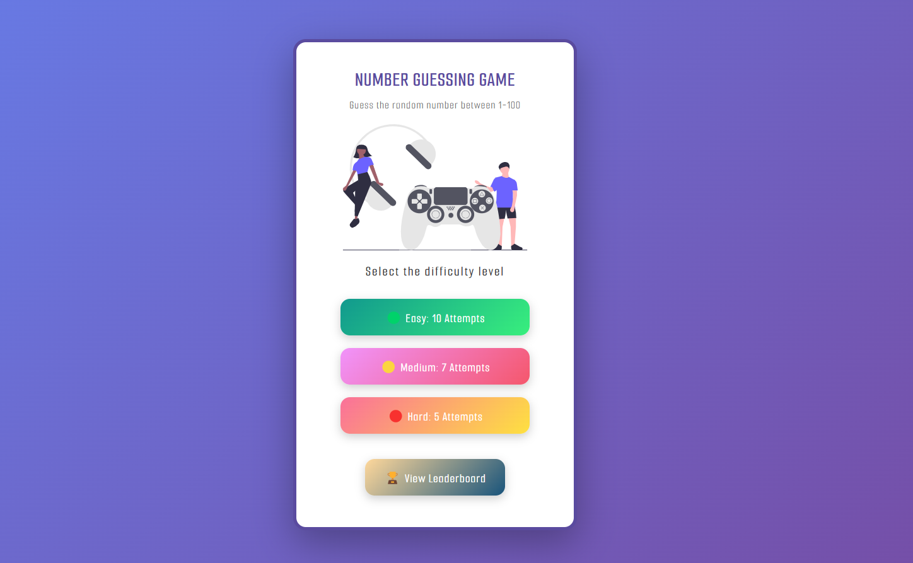

# 🎮 Number Guessing Game

A fun and interactive number guessing game built with HTML, CSS, and JavaScript. Test your luck and skills by guessing a random number between 1 and 100!



Deployed Link --> https://fastidious-cassata-44d456.netlify.app

## 🌟 Features

### 🎯 Core Gameplay
- **Three Difficulty Levels**:
  - 🟢 **Easy Mode**: 10 attempts to guess the number
  - 🟡 **Medium Mode**: 7 attempts to guess the number
  - 🔴 **Hard Mode**: 5 attempts to guess the number

### 🎪 Interactive Features
- **Smart Hints System**: Get up to 2 hints per game
  - Distance-based hints (hot/cold feedback)
  - Number parity hints (odd/even)
- **Real-time Timer**: Track how long it takes to find the number
- **Intelligent Feedback**: Get contextual messages based on how close you are
- **Guess History**: See all your previous guesses in the current game
- **Duplicate Detection**: Prevents you from guessing the same number twice

### 🏆 Leaderboard System
- **Persistent Scores**: Scores are saved locally using localStorage
- **Difficulty-Based Rankings**: Separate leaderboards for each difficulty
- **Top 10 Tracking**: Keep track of the best 10 scores for each difficulty
- **Score Metrics**: Ranked by attempts, then by time
- **Date Tracking**: See when each score was achieved

### 🎨 User Experience
- **Beautiful UI**: Modern gradient design with smooth animations
- **Responsive Design**: Works perfectly on desktop, tablet, and mobile
- **Sound Effects**: Click, win, and lose audio feedback
- **Smooth Animations**: Engaging transitions and hover effects
- **Keyboard Support**: Press ESC to close modals

## 📁 Project Structure

```
project_04/
│
├── assets/              # Game assets
│   ├── game.svg        # Game icon
│   ├── click.wav       # Click sound effect
│   ├── win.wav         # Victory sound effect
│   └── lose.wav        # Game over sound effect
│
├── css/                # Stylesheets
│   └── style.css       # Main stylesheet
│
├── js/                 # JavaScript files
│   └── index.js        # Game logic and functionality
│
├── index.html          # Main HTML file
└── README.md           # Project documentation
```

## 🚀 Getting Started

### Prerequisites
- A modern web browser (Chrome, Firefox, Safari, Edge)
- No additional dependencies required!

### Installation

1. **Clone the repository**
```bash
git clone https://github.com/yourusername/number-guessing-game.git
```

2. **Navigate to the project directory**
```bash
cd number-guessing-game
```

3. **Open the game**
Simply open `index.html` in your web browser, or use a local server:

```bash
# Using Python 3
python -m http.server 8000

# Using Node.js (with http-server)
npx http-server

# Using PHP
php -S localhost:8000
```

Then navigate to `http://localhost:8000` in your browser.

## 🎮 How to Play

1. **Choose Difficulty**: Select your preferred difficulty level:
   - Easy (10 attempts)
   - Medium (7 attempts)
   - Hard (5 attempts)

2. **Make Your Guess**: Enter a number between 1 and 100

3. **Follow the Feedback**:
   - 📈 "Too Low" - Your guess is below the target
   - 📉 "Too High" - Your guess is above the target
   - 🎉 "Correct" - You've won!

4. **Use Hints Wisely**: Click the hint button for help (limited to 2 per game)

5. **Beat Your Best Score**: Try to guess with fewer attempts and in less time!

## 🎯 Game Mechanics

### Scoring System
- **Primary Metric**: Number of attempts (fewer is better)
- **Secondary Metric**: Time taken (faster is better when attempts are equal)
- Scores are automatically saved and ranked

### Hint System
- **First Hint**: Distance feedback + number parity (odd/even)
- **Second Hint**: Another distance feedback + number parity
- Hints are strategic - use them when stuck!

### Feedback Messages
The game provides contextual feedback based on your guess:
- Very far (>30 difference)
- Quite far (15-30 difference)
- Close (5-15 difference)
- Very close (<5 difference)

## 🛠️ Technologies Used

- **HTML5**: Structure and semantic markup
- **CSS3**: Styling, animations, and responsive design
- **JavaScript (ES6+)**: Game logic and interactivity
- **LocalStorage API**: Persistent data storage for leaderboard
- **Web Audio API**: Sound effects

## 🎨 Design Features

- **Modern Gradient Backgrounds**: Dynamic color schemes
- **Smooth Animations**: Slide-in, fade, and hover effects
- **Custom Scrollbar**: Styled scrollbar in modal
- **Responsive Layout**: Mobile-first approach
- **Accessibility**: Semantic HTML and keyboard navigation

## 📱 Browser Compatibility

- ✅ Chrome/Edge (v90+)
- ✅ Firefox (v88+)
- ✅ Safari (v14+)
- ✅ Opera (v76+)

## 🔧 Customization

### Changing Difficulty Settings
Edit `js/index.js`:
```javascript
const easyMode = () => {
    maxGuess = 10;  // Change number of attempts
    currentDifficulty = 'easy';
    startGame();
};
```

### Modifying Number Range
Edit `js/index.js`:
```javascript
const init = () => {
    computer = Math.floor(Math.random() * 100) + 1;  // Change 100 to your max
    // ...
};
```

### Changing Color Scheme
Edit `css/style.css`:
```css
.container {
    background: linear-gradient(135deg, #667eea 0%, #764ba2 100%);
    /* Change gradient colors */
}
```

## 🐛 Known Issues

- Sound effects may not autoplay in some browsers due to autoplay policies
- LocalStorage data will be cleared if browser cache is cleared

## 🚀 Future Enhancements

Potential features for future versions:
- [ ] Multiplayer mode
- [ ] Custom number ranges
- [ ] Achievement system
- [ ] Share scores on social media
- [ ] Dark mode toggle
- [ ] Multiple language support
- [ ] Sound settings (mute/unmute)
- [ ] Animation preferences
- [ ] User profiles with usernames
- [ ] Global online leaderboard

## 👨‍💻 Author

**Aman Sheikh**

Made with ❤️ and JavaScript

## 📄 License

This project is open source and available under the [MIT License](LICENSE).

## 🤝 Contributing

Contributions, issues, and feature requests are welcome!

1. Fork the project
2. Create your feature branch (`git checkout -b feature/AmazingFeature`)
3. Commit your changes (`git commit -m 'Add some AmazingFeature'`)
4. Push to the branch (`git push origin feature/AmazingFeature`)
5. Open a Pull Request

## 🙏 Acknowledgments

- Font: [Smooch Sans](https://fonts.google.com/specimen/Smooch+Sans) from Google Fonts
- Inspiration: Classic number guessing games
- Icons: Emoji used for better UX

## 📞 Support

If you have any questions or need help, please open an issue in the repository.

---

**Enjoy the game and may the odds be in your favor! 🎲**

